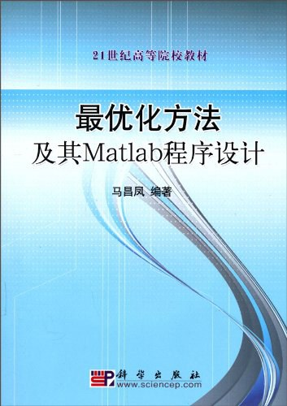

# 最优化方法及其MATLAB实现

5124-2716-7 《最优化方法及其MATLAB实现》 程序包新 习题

  

---

## 程序使用说明

1.本习题夹所列的例题程序在2019版本中全部运行通过，经过测试，部分在2014与2016版本中也能运行通过。

2.请按照例题给出的函数输入格式输入参数。

3.运行程序前请将所有的例题程序所在的文件列入matlab的搜索路径中。

4.由于没有测试全部的程序是否能在2014与2016版本中通过，所以当用这两个版本运行程序时有可能会出现问题。

5.运行时如果出现程序错误，或者出现函数缺失（无定义）等问题，请联系作者。作者邮箱xuggsx@sins.com，微信13572198239。

